# 医院信息管理系统

> **课程**: 数据库的设计与实施  
> **作者**: 袁子轩  
> **学号**: 3123004721  
> **日期**: 2025年12月

---

## 📋 项目简介

本项目是基于 **Python Flask** 框架和 **Microsoft SQL Server** 数据库实现的医院信息管理系统。系统提供完整的医院业务管理功能，包括挂号管理、医生管理、病人管理、药品管理、处方管理、收费管理、支付管理和取药管理等核心模块，同时提供丰富的数据统计分析功能。

### 🌟 主要特性

| 特性 | 描述 |
|------|------|
| 🏥 完整业务流程 | 涵盖挂号 → 诊断 → 开方 → 收费 → 支付 → 取药全流程 |
| 💾 规范数据库设计 | 8张核心数据表，符合3NF规范，支持逻辑删除 |
| 🖥️ 友好Web界面 | 基于Bootstrap 5的响应式设计，全中文界面 |
| 📊 数据完整性 | 通过存储过程保证数据一致性和级联操作 |
| 📈 统计分析 | 提供科室统计、医生工作量、热门药品、收入统计等分析 |
| ⚡ 高性能 | 合理的索引设计和视图优化 |

---

## 📂 目录结构

```
医院管理系统/
├── docs/                           # 📄 项目文档
│   ├── README.md                   # 本说明文件
│   ├── 数据库的设计与实施_3123004721_袁子轩.md  # 课程设计报告（Markdown版）
│   ├── 数据库课程设计-医院管理数据库.docx       # 课程设计报告（Word版）
│   └── 数据库课程设计-医院管理数据库.pdf        # 课程设计报告（PDF版）
│
├── src/                            # 💻 核心源代码
│   ├── app.py                      # Flask主应用程序
│   ├── init_db.py                  # 数据库初始化脚本
│   ├── requirements.txt            # Python依赖列表
│   └── templates/                  # HTML模板文件
│       ├── base.html               # 基础模板（导航栏、布局）
│       ├── index.html              # 首页/仪表盘
│       ├── registration.html       # 挂号管理
│       ├── doctors.html            # 医生管理
│       ├── patients.html           # 病人管理
│       ├── drugs.html              # 药品管理
│       ├── prescriptions.html      # 处方管理
│       ├── charges.html            # 收费管理
│       ├── payments.html           # 支付管理
│       ├── pickups.html            # 取药管理
│       └── analysis.html           # 数据统计分析
│
└── sql/                            # 🗄️ 数据库设计资源
    ├── sql_server_schema.sql       # SQL Server完整建表脚本
    └── sql建表.md                  # 数据库设计说明文档（原始MySQL版本参考）
```

---

## 🛠️ 技术栈

| 类别 | 技术 |
|------|------|
| **后端框架** | Python 3.11 + Flask |
| **数据库** | Microsoft SQL Server 2019/2022 |
| **前端** | HTML5 + Bootstrap 5 + JavaScript |
| **数据库连接** | pyodbc (ODBC Driver 17 for SQL Server) |
| **开发工具** | VS Code / SSMS (SQL Server Management Studio) |

---

## 🚀 快速开始

### 1. 环境准备

**必需软件：**
- Python 3.7 或更高版本（推荐3.11）
- Microsoft SQL Server 2019 或更高版本
- ODBC Driver 17 for SQL Server
- SQL Server Management Studio (SSMS)

**安装Python依赖：**
```bash
cd src
pip install flask pyodbc
# 或使用 requirements.txt
pip install -r requirements.txt
```

### 2. 数据库配置

1. **创建数据库并执行建表脚本**
   
   在SSMS中执行 `sql/sql_server_schema.sql`，该脚本会自动：
   - 创建数据库 `hospital_3123004721_袁子轩`
   - 创建所有数据表（名称后加学号和姓名后缀）
   - 创建索引和约束
   - 插入测试数据

2. **配置数据库连接**
   
   `src/app.py` 中的数据库配置已预设：
   ```python
   # 数据库配置
   SERVER = 'localhost'           # 修改为你的服务器地址
   DATABASE = 'hospital_3123004721_袁子轩'  # 数据库名称
   
   # 表名常量 - 命名规范：表名_学号_姓名
   TABLE_SUFFIX = '_3123004721_袁子轩'
   T_REGISTER = f'register{TABLE_SUFFIX}'   # register_3123004721_袁子轩
   T_DOCTOR = f'doctor{TABLE_SUFFIX}'       # doctor_3123004721_袁子轩
   # ... 其他表
   
   # Windows身份验证（推荐）
   CONNECTION_STRING = f'DRIVER={{ODBC Driver 17 for SQL Server}};SERVER={SERVER};DATABASE={DATABASE};Trusted_Connection=yes;'
   ```

3. **启动应用**
   ```bash
   cd src
   python app.py
   ```

4. **访问系统**
   
   打开浏览器访问 http://127.0.0.1:5000

### 命名规范说明

本项目所有数据库对象均采用以下命名规范：

| 对象类型 | 命名格式 | 示例 |
|---------|---------|------|
| **数据库** | `hospital_学号_姓名` | `hospital_3123004721_袁子轩` |
| **表** | `表名_学号_姓名` | `register_3123004721_袁子轩` |

**表名对照**：
| 原始表名 | 新表名 |
|---------|--------|
| `register` | `register_3123004721_袁子轩` |
| `doctor` | `doctor_3123004721_袁子轩` |
| `patient` | `patient_3123004721_袁子轩` |
| `drugs` | `drugs_3123004721_袁子轩` |
| `recipel` | `recipel_3123004721_袁子轩` |
| `prescription_drug` | `prescription_drug_3123004721_袁子轩` |
| `charge` | `charge_3123004721_袁子轩` |
| `pay` | `pay_3123004721_袁子轩` |
| `PGM` | `PGM_3123004721_袁子轩` |

---

## 📊 功能模块

### 核心业务流程图

```mermaid
graph LR
    A[挂号] --> B[诊断开方]
    B --> C[生成收费]
    C --> D[支付]
    D --> E[生成取药票单]
    E --> F[取药]
```



### 功能模块详情

| 模块 | 路由 | 功能描述 |
|------|------|---------|
| 🏠 首页 | `/` | 系统概览、快速导航 |
| 📝 挂号管理 | `/registration` | 病人挂号登记、查询、删除（级联删除所有关联记录） |
| 👨‍⚕️ 医生管理 | `/doctors` | 医生信息的增删改查 |
| 👤 病人管理 | `/patients` | 病人档案管理、病例记录 |
| 💊 药品管理 | `/drugs` | 药品信息、库存管理、有效期管理 |
| 📋 处方管理 | `/prescriptions` | 开具处方、添加药品（自动扣库存、生成收费） |
| 💰 收费管理 | `/charges` | 查看收费记录（由处方自动生成） |
| 💳 支付管理 | `/payments` | 费用支付（自动生成取药票单） |
| 💉 取药管理 | `/pickups` | 取药票单查看、标记已取药 |
| 📈 数据统计 | `/statistics` | 科室统计、医生工作量、热门药品、收入分析等 |

---

## 🗄️ 数据库设计

### 核心数据表

| 表名 | 说明 | 主键 |
|------|------|------|
| `doctor_3123004721_袁子轩` | 医生信息表 | `d_octor_id` (医生编号) |
| `patient_3123004721_袁子轩` | 病人信息表 | `p_atient_id` (身份证号) |
| `drugs_3123004721_袁子轩` | 药品信息表 | `drug_id` (药品编号) |
| `register_3123004721_袁子轩` | 挂号记录表 | `r_num` (挂号编号) |
| `recipel_3123004721_袁子轩` | 处方信息表 | `id` (处方编号) |
| `prescription_drug_3123004721_袁子轩` | 处方药品表 | `prescription_id, drug_id` (复合主键) |
| `charge_3123004721_袁子轩` | 收费记录表 | `toll_id` (收费编号) |
| `pay_3123004721_袁子轩` | 支付记录表 | `patient_id, t_id` (复合主键) |
| `PGM_3123004721_袁子轩` | 取药票单表 | `t_id, drug_id` (复合主键) |

### 数据表关系（E-R图）

```mermaid
erDiagram
    doctor ||--o{ register : "接诊"
    patient ||--o{ register : "挂号"
    register ||--o| recipel : "开具"
    recipel ||--|{ prescription_drug : "包含"
    drugs ||--o{ prescription_drug : "被开"
    drugs ||--o{ charge : "收费"
    recipel ||--o{ charge : "产生"
    patient ||--o{ pay : "支付"
    charge ||--o| pay : "被支付"
    pay ||--|{ PGM : "生成"
    drugs ||--o{ PGM : "取药"
```



### 常用视图

| 视图名 | 描述 |
|--------|------|
| `v_Registrations` | 挂号信息汇总视图 |
| `v_Doctors` | 在岗医生信息视图 |
| `v_Patients` | 病人信息视图 |
| `v_Drugs` | 药品库存视图 |
| `v_LowStockDrugs` | 库存预警视图（库存<10） |
| `v_PrescriptionDetails` | 处方详情视图 |
| `v_UnprescribedRegistrations` | 未开处方的挂号 |
| `v_UnpaidCharges` | 未支付收费视图 |
| `v_Pickups` | 取药票单视图 |
| `v_DeptRegistrationStats` | 科室挂号统计 |
| `v_DoctorWorkloadStats` | 医生工作量统计 |
| `v_PopularDrugs` | 热门药品统计 |
| `v_RevenueStats` | 收入统计 |
| `v_PickupStats` | 取药完成率统计 |
| `v_PendingTasks` | 待处理事项统计 |

---

## 📝 存储过程说明

### 挂号管理
```sql
-- 添加挂号
EXEC sp_AddRegistration '身份证号', N'姓名', N'性别', N'科室', N'医生姓名';

-- 删除挂号（级联删除所有关联数据，恢复库存）
EXEC sp_DeleteRegistration 挂号编号;
```

### 医生管理
```sql
-- 添加医生
EXEC sp_AddDoctor 医生编号, N'姓名', N'性别', 年龄, N'科室', '电话';

-- 编辑医生
EXEC sp_EditDoctor 医生编号, N'新姓名', N'新性别', 新年龄, N'新科室', '新电话';

-- 删除医生
EXEC sp_DeleteDoctor 医生编号;
```

### 处方管理
```sql
-- 创建处方
DECLARE @prescription_id INT;
EXEC sp_CreatePrescription 挂号编号, 医生编号, N'病人姓名', @prescription_id OUTPUT;

-- 添加处方药品（自动扣库存、生成收费记录）
EXEC sp_AddPrescriptionDrug @prescription_id, '药品编号', 数量;

-- 删除处方（恢复库存）
EXEC sp_DeletePrescription 处方编号;
```

### 支付管理
```sql
-- 支付（自动生成取药票单）
EXEC sp_MakePayment '病人身份证号', '收费编号', 金额;

-- 删除支付（级联删除取药票单）
EXEC sp_DeletePayment '病人身份证号', '收费编号';
```

### 取药管理
```sql
-- 标记单个药品已取药
EXEC sp_MarkPickup '收费编号', '药品编号';

-- 标记全部已取药
EXEC sp_MarkAllPickup '收费编号';
```

---

## ⚠️ 级联删除说明

### 删除挂号时的级联顺序
```
恢复药品库存 → 取药票单(PGM) → 支付(pay) → 收费(charge) → 处方药品(prescription_drug) → 处方(recipel) → 挂号(register)
```

### 删除处方时的级联顺序
```
恢复库存 → 收费(charge) → 处方药品(prescription_drug) → 处方(recipel)
```

### 删除支付时的级联顺序
```
取药票单(PGM) → 支付(pay)
```

---

## 📸 系统截图

### 首页仪表盘
系统首页展示核心统计数据、快速操作入口和待处理事项提醒。

### 挂号管理
支持新增挂号、按科室/医生/日期筛选、级联删除等操作。

### 处方管理
开具处方、添加多种药品、自动计算费用、生成收费记录。

### 数据统计
提供科室挂号统计、医生工作量排行、热门药品TOP10、收入趋势等可视化图表。

---

## 🔧 常见问题

### Q1: 连接数据库失败
**解决方案：**
1. 确认 SQL Server 服务已启动
2. 检查 `ODBC Driver 17 for SQL Server` 是否已安装
3. 验证数据库名称和服务器地址是否正确
4. 如使用 SQL Server 身份验证，确认用户名密码正确

### Q2: 中文乱码
**解决方案：**
- 确保数据库排序规则为 `Chinese_PRC_CI_AS`
- 使用 `N''` 前缀处理中文字符串

### Q3: 删除数据失败
**解决方案：**
- 检查是否有关联数据（如挂号下有处方）
- 使用存储过程执行级联删除

---

## 📚 参考资料

- [Flask 官方文档](https://flask.palletsprojects.com/)
- [SQL Server 官方文档](https://docs.microsoft.com/zh-cn/sql/sql-server/)
- [Bootstrap 5 官方文档](https://getbootstrap.com/)
- [pyodbc 文档](https://github.com/mkleehammer/pyodbc)

---

## 📄 许可证

本项目仅供学习交流使用。

---

**作者**: 袁子轩  
**学号**: 3123004721  
**联系方式**: 如有问题请联系作者
