# 医院信息管理系统课程设计报告

**姓名：袁子轩**  
**学号：3123004721**  
**专业班级：计算机科学与技术**  
**指导教师：XXX**  
**完成时间：2025年1月**

---

## 摘要

本课程设计基于SQL Server数据库和Python Flask Web框架，设计并实现了一套完整的医院门诊信息管理系统。系统涵盖病人挂号、医生管理、病人档案、药品库存、处方开具、收费结算、支付管理、取药票单和数据统计等核心功能模块。通过规范化的数据库设计，建立了8张数据表、5个视图、4个存储过程和4个触发器，并采用B/S架构实现了友好的用户界面。系统实现了门诊业务的全流程信息化管理，具有良好的实用性和扩展性。

**关键词**：医院信息管理系统；数据库设计；Flask；SQL Server；B/S架构

---

## 目录

1. [绪论](#第1章-绪论)
2. [可行性分析](#第2章-可行性分析)
3. [需求分析](#第3章-需求分析)
4. [系统概要设计](#第4章-系统概要设计)
5. [系统详细设计](#第5章-系统详细设计)
6. [数据库实施](#第6章-数据库实施)
7. [系统实现](#第7章-系统实现)
8. [系统测试](#第8章-系统测试)
9. [总结与展望](#第9章-总结与展望)
10. [参考文献](#参考文献)

---

## 第1章 绪论

### 1.1 选题背景及意义

随着医疗卫生事业的快速发展，医院门诊业务量持续增长，传统的手工管理模式已难以满足现代医疗服务的需求。门诊作为医院对外服务的重要窗口，承担着挂号、就诊、处方、收费、取药等核心业务流程，其管理效率直接影响患者就医体验和医院运营效能。

开发医院信息管理系统具有以下重要意义：

1. **提高工作效率**：通过信息化手段实现业务流程自动化，减少人工操作失误
2. **优化患者体验**：缩短挂号、缴费、取药等环节的等待时间
3. **加强数据管理**：实现医疗数据的规范化存储和统计分析
4. **保障信息安全**：通过数据库完整性约束和触发器机制确保数据一致性

### 1.2 研究现状

目前国内外医院信息管理系统发展较为成熟，主流的HIS（Hospital Information System）系统通常采用C/S或B/S架构，涵盖门诊、住院、药房、检验等多个子系统。本课程设计聚焦于门诊信息管理的核心功能，采用轻量级的Web技术栈实现系统开发。

### 1.3 研究目标及技术方案

**研究目标**：设计并实现一套功能完整、界面友好、运行稳定的医院门诊信息管理系统。

**技术方案**：

- **数据库管理系统**：Microsoft SQL Server 2019
- **后端开发框架**：Python Flask 2.x
- **前端技术**：HTML5 + Bootstrap 5 + JavaScript
- **系统架构**：B/S（Browser/Server）架构
- **数据库驱动**：pyodbc

### 1.4 论文结构

本文共分为9章：第1章绪论介绍选题背景；第2章进行可行性分析；第3章完成需求分析；第4章进行概要设计；第5章详细设计；第6章数据库实施；第7章系统实现；第8章系统测试；第9章总结与展望。

---

## 第2章 可行性分析

### 2.1 技术可行性

本系统采用成熟的技术栈进行开发：

- **SQL Server**：微软公司的关系型数据库管理系统，支持存储过程、触发器、视图等高级特性，能够满足复杂业务逻辑的实现需求
- **Python Flask**：轻量级Web框架，具有简洁灵活、易于扩展的特点，适合快速开发中小型Web应用
- **pyodbc**：Python数据库连接库，提供对ODBC数据源的标准访问接口
- **Bootstrap 5**：流行的前端UI框架，提供响应式布局和丰富的组件

以上技术均为开源或免费软件，文档资料丰富，技术支持完善，具备良好的技术可行性。


### 2.2 操作可行性

系统采用B/S架构，用户通过浏览器即可访问，无需安装客户端软件。界面设计遵循简洁直观的原则，操作流程符合门诊业务习惯，医护人员经过简单培训即可熟练使用。

**操作优势**：

- 界面友好，符合直觉
- 流程清晰，易于上手
- 支持键盘快捷操作
- 提供操作提示和错误反馈

---

## 第3章 需求分析

### 3.1 业务流程分析

门诊业务主要包括以下流程：


### 3.2 功能需求分析

通过对医院门诊业务流程的调研分析，系统需要实现以下功能模块：

#### 3.2.1 挂号管理

- 录入病人挂号信息（身份证号、姓名、性别、科室、医生）
- 自动分配挂号编号
- 查询、删除挂号记录
- 支持根据身份证号自动填充病人信息

#### 3.2.2 医生管理

- 维护医生基本信息（编号、姓名、性别、年龄、科室、电话）
- 设置医生在岗状态
- 支持医生信息的增删改查

#### 3.2.3 病人管理

- 维护病人档案（身份证号、姓名、年龄、性别、电话、病例）
- 支持病例信息的更新
- 级联删除关联的挂号、处方、收费等记录

#### 3.2.4 药品管理

- 维护药品信息（编号、名称、价格、库存、存储位置、生产日期、有效期）
- 支持药品模糊查询
- 库存预警功能

#### 3.2.5 处方管理

- 基于挂号记录开具处方
- 添加多种药品，自动计算费用
- 自动扣减药品库存
- 自动生成收费记录

#### 3.2.6 收费管理

- 查看收费明细
- 关联处方和药品信息

#### 3.2.7 支付管理

- 处理病人缴费
- 自动生成取药票单

#### 3.2.8 取药管理

- 显示待取药列表
- 标记取药完成状态

#### 3.2.9 数据统计

- 挂号量统计（今日/本周/本月）
- 收入统计与分析
- 科室工作量排行
- 医生工作量排行
- 热门药品排行
- 库存预警提醒

### 3.3 非功能需求分析

#### 3.3.1 性能需求

- 系统响应时间应小于3秒
- 支持至少50个并发用户访问
- 数据库查询优化，复杂查询响应时间<5秒

#### 3.3.2 安全性需求

- 数据库完整性约束
- 防止SQL注入攻击（参数化查询）
- 数据逻辑删除，保留历史记录
- 敏感数据访问控制

#### 3.3.3 可靠性需求

- 数据库定期备份（完整/差异/日志备份）
- 事务处理保证数据一致性
- 触发器保障业务规则
- 系统可用性≥99%

#### 3.3.4 可维护性需求

- 代码结构清晰，模块化设计
- 数据库对象命名规范
- 完善的注释文档
- 便于功能扩展

### 3.4 数据字典

#### 3.4.1 挂号表数据项

| 数据项 | 数据类型 | 长度 | 约束 | 说明 |
|--------|----------|------|------|------|
| r_num | INT | - | PRIMARY KEY, IDENTITY | 挂号编号 |
| r_patient_id | VARCHAR | 20 | NOT NULL | 病人身份证号 |
| r_P_name | NVARCHAR | 20 | NOT NULL | 病人姓名 |
| r_sex | NVARCHAR | 2 | NOT NULL | 性别 |
| r_dept | NVARCHAR | 20 | NOT NULL | 挂号科室 |
| r_doctor_id | INT | - | NOT NULL | 医生ID |
| r_name | NVARCHAR | 10 | NOT NULL | 医生姓名 |
| is_delete | TINYINT | - | DEFAULT 0 | 删除标志 |
| create_time | DATETIME | - | DEFAULT GETDATE() | 创建时间 |
| update_time | DATETIME | - | DEFAULT GETDATE() | 更新时间 |

#### 3.4.2 医生表数据项

| 数据项 | 数据类型 | 长度 | 约束 | 说明 |
|--------|----------|------|------|------|
| d_octor_id | INT | - | PRIMARY KEY | 医生编号 |
| d_name | NVARCHAR | 20 | NOT NULL | 医生姓名 |
| d_sex | NVARCHAR | 2 | NOT NULL | 性别 |
| d_age | TINYINT | - | NOT NULL | 年龄 |
| d_dept | NVARCHAR | 50 | NOT NULL | 科室 |
| d_tel | VARCHAR | 20 | NOT NULL | 电话 |
| is_jobing | TINYINT | - | DEFAULT 1 | 在岗状态 |
| is_delete | TINYINT | - | DEFAULT 0 | 删除标志 |

#### 3.4.3 病人表数据项

| 数据项 | 数据类型 | 长度 | 约束 | 说明 |
|--------|----------|------|------|------|
| p_atient_id | VARCHAR | 20 | PRIMARY KEY | 身份证号 |
| p_name | NVARCHAR | 20 | NOT NULL | 姓名 |
| p_age | TINYINT | - | NOT NULL | 年龄 |
| p_sex | NVARCHAR | 2 | NOT NULL | 性别 |
| p_tel | VARCHAR | 20 | NOT NULL | 电话 |
| p_inf | NVARCHAR | 50 | NOT NULL | 病例 |
| is_delete | TINYINT | - | DEFAULT 0 | 删除标志 |

#### 3.4.4 药品表数据项

| 数据项 | 数据类型 | 长度 | 约束 | 说明 |
|--------|----------|------|------|------|
| drug_id | VARCHAR | 10 | PRIMARY KEY | 药品编号 |
| drug_name | NVARCHAR | 50 | NOT NULL | 药品名称 |
| drug_price | DECIMAL | 10,2 | NOT NULL | 单价 |
| drug_quantity | BIGINT | - | NOT NULL | 库存数量 |
| drug_storage | NVARCHAR | 50 | NOT NULL | 存储位置 |
| drug_date | DATETIME | - | NOT NULL | 生产日期 |
| usefull_life | DATETIME | - | NOT NULL | 有效期 |
| is_delete | TINYINT | - | DEFAULT 0 | 删除标志 |

---

## 第4章 系统概要设计

### 4.1 系统架构设计

本系统采用B/S（Browser/Server）三层架构：

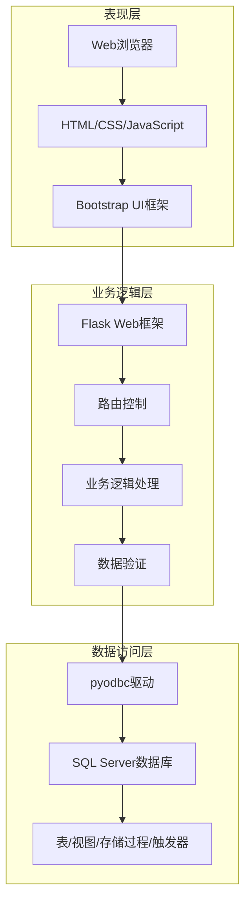

**架构优势**：

- **表现层**：响应式设计，支持多种设备访问
- **业务逻辑层**：Python Flask提供灵活的路由和中间件机制
- **数据访问层**：SQL Server强大的数据管理和事务处理能力

### 4.2 功能模块设计

系统功能模块图如下：

```mermaid
graph TB
    A[医院信息管理系统]
    
    A --> B[挂号管理]
    A --> C[医生管理]
    A --> D[病人管理]
    A --> E[药品管理]
    A --> F[处方管理]
    A --> G[收费管理]
    A --> H[支付管理]
    A --> I[取药管理]
    A --> J[数据统计]
    
    B --> B1[新增挂号]
    B --> B2[查询挂号]
    B --> B3[删除挂号]
    
    C --> C1[添加医生]
    C --> C2[编辑医生]
    C --> C3[删除医生]
    C --> C4[在岗管理]
    
    D --> D1[添加病人]
    D --> D2[编辑病人]
    D --> D3[删除病人]
    D --> D4[病例管理]
    
    E --> E1[药品入库]
    E --> E2[库存查询]
    E --> E3[药品编辑]
    E --> E4[库存预警]
    
    F --> F1[开具处方]
    F --> F2[处方查询]
    F --> F3[处方删除]
    
    G --> G1[收费查询]
    G --> G2[费用明细]
    
    H --> H1[缴费处理]
    H --> H2[支付记录]
    
    I --> I1[取药列表]
    I --> I2[取药确认]
    
    J --> J1[挂号统计]
    J --> J2[收入分析]
    J --> J3[排行榜]
```

### 4.3 概念结构设计（E-R图）

#### 4.3.1 实体及属性

**病人实体**：身份证号（主键）、姓名、年龄、性别、电话、病例

**医生实体**：医生编号（主键）、姓名、性别、年龄、科室、电话、在岗状态

**药品实体**：药品编号（主键）、名称、价格、库存量、存储位置、生产日期、有效期

**挂号实体**：挂号编号（主键）、病人身份证、病人姓名、性别、科室、医生ID、医生姓名

**处方实体**：处方编号（主键）、医生ID、病人姓名、挂号ID

**收费实体**：收费员编号+病人ID+药品ID（联合主键）、收费员姓名、数量、金额

**支付实体**：病人ID+收费编号（联合主键）、金额

**取药票单实体**：收费编号+药品ID（联合主键）、数量、价格、取药状态

#### 4.3.2 E-R图

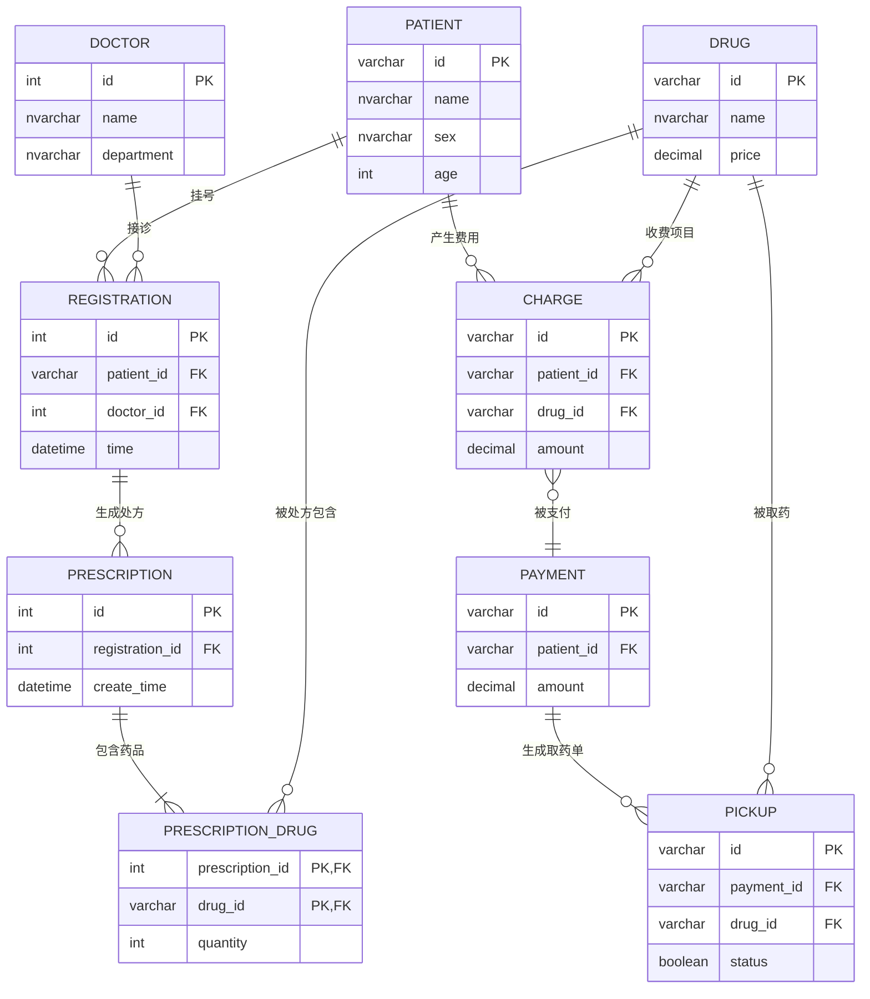

---

## 第5章 系统详细设计

### 5.1 逻辑结构设计

#### 5.1.1 数据库表设计

**表1：挂号表（register_3123004721_yuanzixuan）**

```sql
CREATE TABLE register_3123004721_yuanzixuan (
    r_num INT IDENTITY(1,1) PRIMARY KEY,
    r_patient_id VARCHAR(20) NOT NULL,
    r_P_name NVARCHAR(20) NOT NULL,
    r_sex NVARCHAR(2) NOT NULL,
    r_dept NVARCHAR(20) NOT NULL,
    r_doctor_id INT NOT NULL,
    r_name NVARCHAR(10) NOT NULL,
    is_delete TINYINT NOT NULL DEFAULT 0,
    create_time DATETIME DEFAULT GETDATE(),
    update_time DATETIME DEFAULT GETDATE()
);
```

**表2：医生表（doctor_3123004721_yuanzixuan）**

```sql
CREATE TABLE doctor_3123004721_yuanzixuan (
    d_octor_id INT PRIMARY KEY,
    d_name NVARCHAR(20) NOT NULL,
    d_sex NVARCHAR(2) NOT NULL,
    d_age TINYINT NOT NULL,
    d_dept NVARCHAR(50) NOT NULL,
    d_tel VARCHAR(20) NOT NULL,
    is_jobing TINYINT DEFAULT 1 NOT NULL,
    is_delete TINYINT NOT NULL DEFAULT 0,
    create_time DATETIME DEFAULT GETDATE(),
    update_time DATETIME DEFAULT GETDATE()
);
```

**表3：病人表（patient_3123004721_yuanzixuan）**

```sql
CREATE TABLE patient_3123004721_yuanzixuan (
    p_atient_id VARCHAR(20) PRIMARY KEY,
    p_name NVARCHAR(20) NOT NULL,
    p_age TINYINT NOT NULL,
    p_sex NVARCHAR(2) NOT NULL,
    p_tel VARCHAR(20) NOT NULL,
    p_inf NVARCHAR(50) NOT NULL,
    is_delete TINYINT NOT NULL DEFAULT 0,
    create_time DATETIME DEFAULT GETDATE(),
    update_time DATETIME DEFAULT GETDATE()
);
```

**表4：药品表（drugs_3123004721_yuanzixuan）**

```sql
CREATE TABLE drugs_3123004721_yuanzixuan (
    drug_id VARCHAR(10) PRIMARY KEY,
    drug_name NVARCHAR(50) NOT NULL,
    drug_price DECIMAL(10, 2) NOT NULL,
    drug_quantity BIGINT NOT NULL,
    drug_storage NVARCHAR(50) NOT NULL,
    drug_date DATETIME NOT NULL,
    usefull_life DATETIME NOT NULL,
    is_delete TINYINT NOT NULL DEFAULT 0,
    create_time DATETIME DEFAULT GETDATE(),
    update_time DATETIME DEFAULT GETDATE()
);
```

**表5：处方表（recipel_3123004721_yuanzixuan）**

```sql
CREATE TABLE recipel_3123004721_yuanzixuan (
    id INT IDENTITY(1,1) PRIMARY KEY,
    doctor_id INT NOT NULL,
    patient_name NVARCHAR(20) NOT NULL,
    registration_id INT,
    is_delete TINYINT NOT NULL DEFAULT 0,
    create_time DATETIME DEFAULT GETDATE(),
    update_time DATETIME DEFAULT GETDATE()
);
```

**表6：处方药品关联表（prescription_drug_3123004721_yuanzixuan）**

```sql
CREATE TABLE prescription_drug_3123004721_yuanzixuan (
    prescription_id INT NOT NULL,
    drug_id VARCHAR(10) NOT NULL,
    quantity INT NOT NULL,
    is_delete TINYINT NOT NULL DEFAULT 0,
    create_time DATETIME DEFAULT GETDATE(),
    update_time DATETIME DEFAULT GETDATE(),
    PRIMARY KEY (prescription_id, drug_id),
    FOREIGN KEY (prescription_id) REFERENCES recipel_3123004721_yuanzixuan(id) ON DELETE CASCADE
);
```

**表7：收费表（charge_3123004721_yuanzixuan）**

```sql
CREATE TABLE charge_3123004721_yuanzixuan (
    toll_id VARCHAR(10),
    t_name NVARCHAR(10) NOT NULL,
    patient_id VARCHAR(20),
    drug_id VARCHAR(10),
    drug_quantity INT NOT NULL,
    amount DECIMAL(10, 2) NOT NULL,
    is_delete TINYINT NOT NULL DEFAULT 0,
    create_time DATETIME DEFAULT GETDATE(),
    update_time DATETIME DEFAULT GETDATE(),
    PRIMARY KEY (toll_id, patient_id, drug_id)
);
```

**表8：支付表（pay_3123004721_yuanzixuan）**

```sql
CREATE TABLE pay_3123004721_yuanzixuan (
    patient_id VARCHAR(20),
    t_id VARCHAR(10),
    price DECIMAL(10, 2) NOT NULL,
    is_delete TINYINT NOT NULL DEFAULT 0,
    create_time DATETIME DEFAULT GETDATE(),
    update_time DATETIME DEFAULT GETDATE(),
    PRIMARY KEY (patient_id, t_id)
);
```

**表9：取药票单表（PGM_3123004721_yuanzixuan）**

```sql
CREATE TABLE PGM_3123004721_yuanzixuan (
    t_id VARCHAR(10) NOT NULL,
    drug_id VARCHAR(10) NOT NULL,
    quantity INT NOT NULL,
    price DECIMAL(10, 2) NOT NULL,
    is_picked TINYINT NOT NULL DEFAULT 0,
    is_delete TINYINT NOT NULL DEFAULT 0,
    create_time DATETIME DEFAULT GETDATE(),
    update_time DATETIME DEFAULT GETDATE(),
    PRIMARY KEY (t_id, drug_id)
);
```

#### 5.1.2 范式分析

以病人表为例进行范式分析：

**第一范式（1NF）**：所有字段都是原子性的，不可再分，满足1NF。

| 字段 | 是否原子 | 说明 |
|------|---------|------|
| p_atient_id | ✓ | 身份证号，不可分 |
| p_name | ✓ | 姓名，原子值 |
| p_age | ✓ | 年龄，数值 |
| p_sex | ✓ | 性别，原子值 |
| p_tel | ✓ | 电话，原子值 |
| p_inf | ✓ | 病例，文本 |

**第二范式（2NF）**：主键为p_atient_id，所有非主属性完全函数依赖于主键，满足2NF。

函数依赖关系：
- p_atient_id → p_name
- p_atient_id → p_age
- p_atient_id → p_sex
- p_atient_id → p_tel
- p_atient_id → p_inf

**第三范式（3NF）**：不存在非主属性对主键的传递依赖，满足3NF。

**结论**：所有表均满足第三范式要求，数据库设计规范化。

#### 5.1.3 视图设计

**视图1：病人就诊记录综合视图（v_patient_records_3123004721）**

功能：多表连接查询，展示病人完整就诊信息

```sql
CREATE VIEW v_patient_records_3123004721 AS
SELECT 
    r.r_num AS '挂号编号',
    r.r_patient_id AS '病人身份证',
    r.r_P_name AS '病人姓名',
    r.r_sex AS '性别',
    r.r_dept AS '就诊科室',
    d.d_name AS '主治医生',
    d.d_tel AS '医生电话',
    p.p_inf AS '病例描述',
    p.p_tel AS '病人电话',
    r.create_time AS '挂号时间'
FROM register_3123004721_yuanzixuan r
LEFT JOIN doctor_3123004721_yuanzixuan d ON r.r_doctor_id = d.d_octor_id AND d.is_delete = 0
LEFT JOIN patient_3123004721_yuanzixuan p ON r.r_patient_id = p.p_atient_id AND p.is_delete = 0
WHERE r.is_delete = 0;
```

**视图2：药品库存预警视图（v_drug_inventory_warning_3123004721）**

功能：显示库存不足或即将过期的药品

```sql
CREATE VIEW v_drug_inventory_warning_3123004721 AS
SELECT 
    drug_id AS '药品编号',
    drug_name AS '药品名称',
    drug_price AS '单价',
    drug_quantity AS '当前库存',
    drug_storage AS '存储位置',
    usefull_life AS '有效期',
    CASE 
        WHEN drug_quantity < 100 THEN N'库存不足'
        WHEN usefull_life < DATEADD(MONTH, 3, GETDATE()) THEN N'即将过期'
        ELSE N'正常'
    END AS '预警状态',
    DATEDIFF(DAY, GETDATE(), usefull_life) AS '距过期天数'
FROM drugs_3123004721_yuanzixuan
WHERE is_delete = 0
  AND (drug_quantity < 100 OR usefull_life < DATEADD(MONTH, 3, GETDATE()));
```

**视图3：每日营收统计视图（v_daily_revenue_3123004721）**

功能：分组聚集统计每日收入

```sql
CREATE VIEW v_daily_revenue_3123004721 AS
SELECT 
    CONVERT(DATE, create_time) AS '日期',
    COUNT(*) AS '收费笔数',
    SUM(amount) AS '当日营收',
    AVG(amount) AS '平均单笔金额',
    MAX(amount) AS '最大单笔',
    MIN(amount) AS '最小单笔'
FROM charge_3123004721_yuanzixuan
WHERE is_delete = 0
GROUP BY CONVERT(DATE, create_time);
```

**视图4：科室工作量统计视图（v_dept_workload_3123004721）**

功能：按科室分组统计挂号量

```sql
CREATE VIEW v_dept_workload_3123004721 AS
SELECT 
    r_dept AS '科室名称',
    COUNT(*) AS '挂号总数',
    COUNT(DISTINCT r_doctor_id) AS '出诊医生数',
    COUNT(DISTINCT r_patient_id) AS '就诊病人数'
FROM register_3123004721_yuanzixuan
WHERE is_delete = 0
GROUP BY r_dept;
```

**视图5：处方详情视图（v_prescription_detail_3123004721）**

功能：展示处方及其药品明细

```sql
CREATE VIEW v_prescription_detail_3123004721 AS
SELECT 
    rec.id AS '处方编号',
    rec.patient_name AS '病人姓名',
    doc.d_name AS '开方医生',
    doc.d_dept AS '科室',
    drg.drug_name AS '药品名称',
    pd.quantity AS '数量',
    drg.drug_price AS '单价',
    (pd.quantity * drg.drug_price) AS '小计金额',
    rec.create_time AS '开方时间'
FROM recipel_3123004721_yuanzixuan rec
JOIN prescription_drug_3123004721_yuanzixuan pd ON rec.id = pd.prescription_id AND pd.is_delete = 0
JOIN drugs_3123004721_yuanzixuan drg ON pd.drug_id = drg.drug_id AND drg.is_delete = 0
JOIN doctor_3123004721_yuanzixuan doc ON rec.doctor_id = doc.d_octor_id AND doc.is_delete = 0
WHERE rec.is_delete = 0;
```

### 5.2 物理结构设计

基于SQL Server的物理存储设计：

#### 5.2.1 文件组织

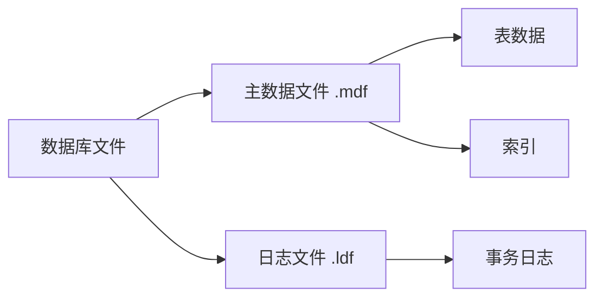

**文件说明**：

| 文件类型 | 文件名 | 大小 | 增长率 |
|----------|--------|------|--------|
| 主数据文件 | hospital_3123004721_yuanzixuan.mdf | 初始50MB | 自动增长10% |
| 日志文件 | hospital_3123004721_yuanzixuan_log.ldf | 初始10MB | 自动增长10% |

#### 5.2.2 索引设计

**主键索引（聚集索引）**：

- register_3123004721_yuanzixuan: r_num
- doctor_3123004721_yuanzixuan: d_octor_id
- patient_3123004721_yuanzixuan: p_atient_id
- drugs_3123004721_yuanzixuan: drug_id
- recipel_3123004721_yuanzixuan: id

**非聚集索引**：

```sql
-- 病人姓名索引（高频查询）
CREATE INDEX idx_patient_name ON patient_3123004721_yuanzixuan(p_name);

-- 药品名称索引（模糊查询优化）
CREATE INDEX idx_drug_name ON drugs_3123004721_yuanzixuan(drug_name);

-- 挂号时间索引（统计查询优化）
CREATE INDEX idx_register_time ON register_3123004721_yuanzixuan(create_time);
```

### 5.3 数据库完整性设计

#### 5.3.1 实体完整性

通过主键约束保证实体完整性：

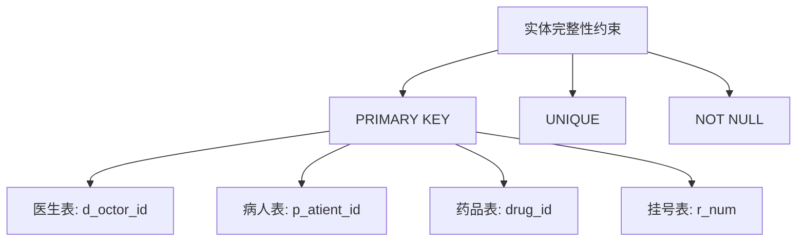

#### 5.3.2 参照完整性

通过外键约束保证参照完整性：

```sql
-- 处方药品关联表外键
FOREIGN KEY (prescription_id) REFERENCES recipel_3123004721_yuanzixuan(id) ON DELETE CASCADE
```

#### 5.3.3 用户定义完整性（触发器）

为了保证脚本的可重复执行性（Idempotency），所有触发器的创建脚本均加入了 `DROP TRIGGER IF EXISTS` 预处理逻辑，防止因对象已存在而导致的脚本执行错误。

**触发器1：挂号时检查医生是否在岗**

```sql
CREATE TRIGGER tr_check_doctor_status_3123004721
ON register_3123004721_yuanzixuan
INSTEAD OF INSERT
AS
BEGIN
    SET NOCOUNT ON;
    
    DECLARE @doctor_id INT, @is_jobing TINYINT;
    
    SELECT @doctor_id = r_doctor_id FROM inserted;
    SELECT @is_jobing = is_jobing FROM doctor_3123004721_yuanzixuan 
           WHERE d_octor_id = @doctor_id AND is_delete = 0;
    
    IF @is_jobing = 0 OR @is_jobing IS NULL
    BEGIN
        RAISERROR(N'该医生当前不在岗，无法挂号！', 16, 1);
        RETURN;
    END
    
    -- 医生在岗，允许插入
    INSERT INTO register_3123004721_yuanzixuan 
        (r_patient_id, r_P_name, r_sex, r_dept, r_doctor_id, r_name, is_delete, create_time, update_time)
    SELECT 
        r_patient_id, r_P_name, r_sex, r_dept, r_doctor_id, r_name, is_delete, 
        ISNULL(create_time, GETDATE()), ISNULL(update_time, GETDATE())
    FROM inserted;
END;
```

**触发器2：处方药品添加时检查库存和有效期**

```sql
CREATE TRIGGER tr_check_drug_stock_3123004721
ON prescription_drug_3123004721_yuanzixuan
INSTEAD OF INSERT
AS
BEGIN
    SET NOCOUNT ON;
    
    -- 检查每个药品的库存
    IF EXISTS (
        SELECT 1 
        FROM inserted i
        JOIN drugs_3123004721_yuanzixuan d ON i.drug_id = d.drug_id AND d.is_delete = 0
        WHERE d.drug_quantity < i.quantity
    )
    BEGIN
        RAISERROR(N'部分药品库存不足，无法开具处方！', 16, 1);
        RETURN;
    END
    
    -- 检查药品是否过期
    IF EXISTS (
        SELECT 1 
        FROM inserted i
        JOIN drugs_3123004721_yuanzixuan d ON i.drug_id = d.drug_id AND d.is_delete = 0
        WHERE d.usefull_life < GETDATE()
    )
    BEGIN
        RAISERROR(N'部分药品已过期，无法开具处方！', 16, 1);
        RETURN;
    END
    
    -- 库存充足且未过期，允许插入
    INSERT INTO prescription_drug_3123004721_yuanzixuan 
        (prescription_id, drug_id, quantity, is_delete, create_time, update_time)
    SELECT 
        prescription_id, drug_id, quantity, ISNULL(is_delete, 0), 
        ISNULL(create_time, GETDATE()), ISNULL(update_time, GETDATE())
    FROM inserted;
END;
```

**触发器3：取药时自动扣减库存**

```sql
CREATE TRIGGER tr_pickup_reduce_stock_3123004721
ON PGM_3123004721_yuanzixuan
AFTER UPDATE
AS
BEGIN
    SET NOCOUNT ON;
    
    -- 当is_picked从0变为1时，扣减库存
    IF EXISTS (SELECT 1 FROM inserted i JOIN deleted d 
               ON i.t_id = d.t_id AND i.drug_id = d.drug_id
               WHERE i.is_picked = 1 AND d.is_picked = 0)
    BEGIN
        UPDATE drugs_3123004721_yuanzixuan
        SET drug_quantity = drug_quantity - i.quantity,
            update_time = GETDATE()
        FROM drugs_3123004721_yuanzixuan d
        JOIN inserted i ON d.drug_id = i.drug_id
        JOIN deleted del ON i.t_id = del.t_id AND i.drug_id = del.drug_id
        WHERE i.is_picked = 1 AND del.is_picked = 0 AND d.is_delete = 0;
    END
END;
```

**触发器4：自动更新update_time字段**

```sql
CREATE TRIGGER tr_auto_update_time_patient_3123004721
ON patient_3123004721_yuanzixuan
AFTER UPDATE
AS
BEGIN
    SET NOCOUNT ON;
    
    UPDATE patient_3123004721_yuanzixuan
    SET update_time = GETDATE()
    FROM patient_3123004721_yuanzixuan p
    JOIN inserted i ON p.p_atient_id = i.p_atient_id;
END;
```

**触发器总结**：

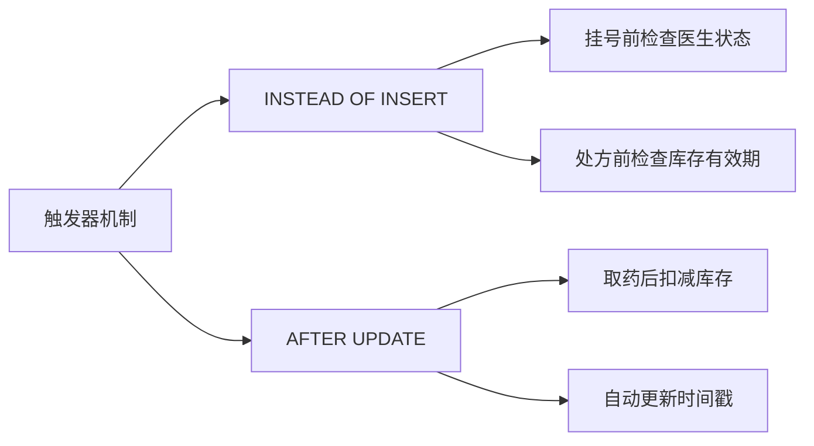

#### 5.3.4 存储过程设计

**存储过程1：统计指定日期范围内各科室问诊人数**

```sql
CREATE PROCEDURE sp_count_visits_by_dept_3123004721
    @begin_date DATETIME,
    @end_date DATETIME
AS
BEGIN
    SET NOCOUNT ON;
    
    SELECT 
        r_dept AS N'科室',
        COUNT(*) AS N'问诊人数',
        COUNT(DISTINCT r_patient_id) AS N'独立病人数'
    FROM register_3123004721_yuanzixuan
    WHERE create_time BETWEEN @begin_date AND @end_date
      AND is_delete = 0
    GROUP BY r_dept
    ORDER BY COUNT(*) DESC;
END;
```

**调用示例**：

```sql
-- 查询2025年1月各科室问诊人数
EXEC sp_count_visits_by_dept_3123004721 
    @begin_date = '2025-01-01', 
    @end_date = '2025-01-31';
```

**存储过程2：处方结算（扣减库存+生成收费记录）**

```sql
CREATE PROCEDURE sp_settle_prescription_3123004721
    @prescription_id INT,
    @toll_id VARCHAR(10),
    @toll_name NVARCHAR(10),
    @patient_id VARCHAR(20)
AS
BEGIN
    SET NOCOUNT ON;
    BEGIN TRANSACTION;
    
    BEGIN TRY
        DECLARE @drug_id VARCHAR(10), @quantity INT, @price DECIMAL(10,2), @current_stock BIGINT;
        DECLARE @total_amount DECIMAL(10,2) = 0;
        
        -- 游标遍历处方中的所有药品
        DECLARE drug_cursor CURSOR FOR
            SELECT pd.drug_id, pd.quantity, d.drug_price, d.drug_quantity
            FROM prescription_drug_3123004721_yuanzixuan pd
            JOIN drugs_3123004721_yuanzixuan d ON pd.drug_id = d.drug_id AND d.is_delete = 0
            WHERE pd.prescription_id = @prescription_id AND pd.is_delete = 0;
        
        OPEN drug_cursor;
        FETCH NEXT FROM drug_cursor INTO @drug_id, @quantity, @price, @current_stock;
        
        WHILE @@FETCH_STATUS = 0
        BEGIN
            -- 检查库存是否充足
            IF @current_stock < @quantity
            BEGIN
                RAISERROR(N'药品库存不足，无法完成结算', 16, 1);
                ROLLBACK TRANSACTION;
                RETURN;
            END
            
            -- 扣减库存
            UPDATE drugs_3123004721_yuanzixuan
            SET drug_quantity = drug_quantity - @quantity,
                update_time = GETDATE()
            WHERE drug_id = @drug_id AND is_delete = 0;
            
            -- 计算金额
            DECLARE @item_amount DECIMAL(10,2) = @quantity * @price;
            SET @total_amount = @total_amount + @item_amount;
            
            -- 插入收费记录
            IF NOT EXISTS (SELECT 1 FROM charge_3123004721_yuanzixuan 
                           WHERE toll_id = @toll_id AND patient_id = @patient_id AND drug_id = @drug_id)
            BEGIN
                INSERT INTO charge_3123004721_yuanzixuan (toll_id, t_name, patient_id, drug_id, drug_quantity, amount)
                VALUES (@toll_id, @toll_name, @patient_id, @drug_id, @quantity, @item_amount);
            END
            
            FETCH NEXT FROM drug_cursor INTO @drug_id, @quantity, @price, @current_stock;
        END
        
        CLOSE drug_cursor;
        DEALLOCATE drug_cursor;
        
        COMMIT TRANSACTION;
        
        -- 返回结算结果
        SELECT N'结算成功' AS '状态', @total_amount AS '总金额';
        
    END TRY
    BEGIN CATCH
        IF @@TRANCOUNT > 0
            ROLLBACK TRANSACTION;
        
        DECLARE @ErrorMessage NVARCHAR(4000) = ERROR_MESSAGE();
        RAISERROR(@ErrorMessage, 16, 1);
    END CATCH
END;
```

**存储过程3：药品入库**

```sql
CREATE PROCEDURE sp_drug_stock_in_3123004721
    @drug_id VARCHAR(10),
    @drug_name NVARCHAR(50),
    @drug_price DECIMAL(10,2),
    @quantity BIGINT,
    @storage NVARCHAR(50),
    @produce_date DATETIME,
    @expire_date DATETIME
AS
BEGIN
    SET NOCOUNT ON;
    
    IF EXISTS (SELECT 1 FROM drugs_3123004721_yuanzixuan WHERE drug_id = @drug_id AND is_delete = 0)
    BEGIN
        -- 已存在，增加库存
        UPDATE drugs_3123004721_yuanzixuan
        SET drug_quantity = drug_quantity + @quantity,
            update_time = GETDATE()
        WHERE drug_id = @drug_id AND is_delete = 0;
        
        SELECT N'库存增加成功' AS '状态', @quantity AS '入库数量';
    END
    ELSE
    BEGIN
        -- 不存在，新增药品
        INSERT INTO drugs_3123004721_yuanzixuan 
            (drug_id, drug_name, drug_price, drug_quantity, drug_storage, drug_date, usefull_life)
        VALUES 
            (@drug_id, @drug_name, @drug_price, @quantity, @storage, @produce_date, @expire_date);
        
        SELECT N'新药品入库成功' AS '状态', @quantity AS '入库数量';
    END
END;
```

**存储过程4：生成病人账单汇总**

```sql
CREATE PROCEDURE sp_generate_patient_bill_3123004721
    @patient_id VARCHAR(20)
AS
BEGIN
    SET NOCOUNT ON;
    
    -- 输出病人基本信息
    SELECT 
        p_atient_id AS '身份证号',
        p_name AS '姓名',
        p_sex AS '性别',
        p_age AS '年龄',
        p_tel AS '联系电话'
    FROM patient_3123004721_yuanzixuan
    WHERE p_atient_id = @patient_id AND is_delete = 0;
    
    -- 输出消费明细
    SELECT 
        c.toll_id AS '收费单号',
        d.drug_name AS '药品名称',
        c.drug_quantity AS '数量',
        d.drug_price AS '单价',
        c.amount AS '金额',
        c.create_time AS '收费时间'
    FROM charge_3123004721_yuanzixuan c
    JOIN drugs_3123004721_yuanzixuan d ON c.drug_id = d.drug_id
    WHERE c.patient_id = @patient_id AND c.is_delete = 0
    ORDER BY c.create_time;
    
    -- 输出汇总信息
    SELECT 
        COUNT(*) AS '消费笔数',
        SUM(amount) AS '消费总额',
        (SELECT SUM(price) FROM pay_3123004721_yuanzixuan 
         WHERE patient_id = @patient_id AND is_delete = 0) AS '已支付金额'
    FROM charge_3123004721_yuanzixuan
    WHERE patient_id = @patient_id AND is_delete = 0;
END;
```

### 5.4 功能模块详细设计

#### 5.4.1 挂号模块

**业务流程图**：

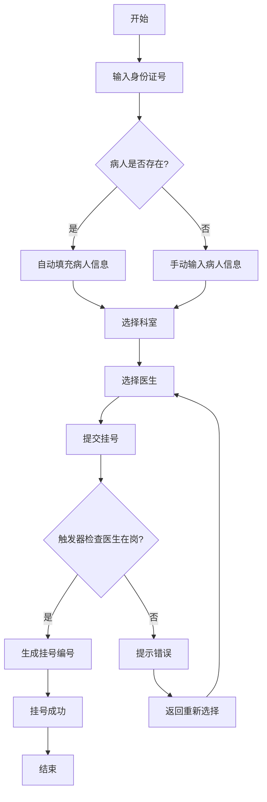

**核心SQL查询**：

```sql
-- 1. 多表连接查询：获取挂号列表
SELECT 
    r.r_num, r.r_patient_id, r.r_P_name, r.r_sex, r.r_dept, r.r_name,
    CONVERT(VARCHAR, r.create_time, 120) as create_time
FROM register_3123004721_yuanzixuan r
WHERE r.is_delete = 0 
ORDER BY r.create_time DESC;

-- 2. 根据身份证号查询病人（支持自动填充）
SELECT p_atient_id, p_name, p_sex 
FROM patient_3123004721_yuanzixuan 
WHERE p_atient_id = ? AND is_delete = 0;

-- 3. 获取科室列表（去重）
SELECT DISTINCT d_dept 
FROM doctor_3123004721_yuanzixuan 
WHERE is_delete = 0 
ORDER BY d_dept;

-- 4. 获取在岗医生列表
SELECT d_octor_id, d_name, d_dept 
FROM doctor_3123004721_yuanzixuan 
WHERE is_delete = 0 AND is_jobing = 1 
ORDER BY d_dept, d_name;
```

#### 5.4.2 处方模块

**业务流程图**：

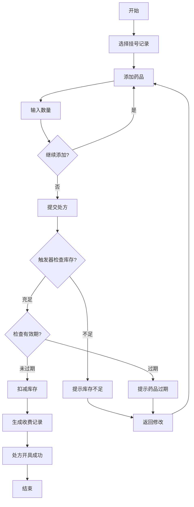

**核心SQL查询**：

```sql
-- 1. 嵌套查询：获取未开处方的挂号
SELECT r_num, r_patient_id, r_P_name, r_dept, r_name 
FROM register_3123004721_yuanzixuan 
WHERE is_delete = 0 
AND r_num NOT IN (
    SELECT registration_id 
    FROM recipel_3123004721_yuanzixuan 
    WHERE registration_id IS NOT NULL
);

-- 2. 检查库存和有效期
SELECT drug_quantity, drug_name, drug_price, usefull_life 
FROM drugs_3123004721_yuanzixuan 
WHERE drug_id = ? AND is_delete = 0;

-- 3. 插入处方药品（触发器自动检查）
INSERT INTO prescription_drug_3123004721_yuanzixuan 
    (prescription_id, drug_id, quantity) 
VALUES (?, ?, ?);

-- 4. 扣减库存
UPDATE drugs_3123004721_yuanzixuan 
SET drug_quantity = drug_quantity - ? 
WHERE drug_id = ?;

-- 5. 自动生成收费记录
INSERT INTO charge_3123004721_yuanzixuan 
    (toll_id, t_name, patient_id, drug_id, drug_quantity, amount) 
VALUES (?, '系统自动', ?, ?, ?, ?);

-- 6. 分组查询：统计处方总金额
SELECT 
    SUM(pd.quantity * d.drug_price) as total_amount
FROM prescription_drug_3123004721_yuanzixuan pd
JOIN drugs_3123004721_yuanzixuan d ON pd.drug_id = d.drug_id
WHERE pd.prescription_id = ?
GROUP BY pd.prescription_id;
```

#### 5.4.3 数据统计模块

**查询类型示例**：

```sql
-- 1. 多表连接查询：病人就诊详情
SELECT 
    r.r_num, r.r_P_name, r.r_dept, r.create_time,
    d.d_name, d.d_tel,
    p.p_inf, p.p_tel
FROM register_3123004721_yuanzixuan r
JOIN doctor_3123004721_yuanzixuan d ON r.r_doctor_id = d.d_octor_id
JOIN patient_3123004721_yuanzixuan p ON r.r_patient_id = p.p_atient_id
WHERE r.is_delete = 0;

-- 2. 自身连接查询：查找同科室医生
SELECT 
    d1.d_name AS '医生姓名', 
    d1.d_dept AS '科室', 
    d2.d_name AS '同事姓名'
FROM doctor_3123004721_yuanzixuan d1
JOIN doctor_3123004721_yuanzixuan d2 
    ON d1.d_dept = d2.d_dept 
    AND d1.d_octor_id <> d2.d_octor_id
WHERE d1.is_delete = 0 AND d2.is_delete = 0;

-- 3. 嵌套查询：统计病人消费与支付
SELECT 
    patient_id,
    SUM(amount) as total_charge,
    (SELECT SUM(price) 
     FROM pay_3123004721_yuanzixuan 
     WHERE patient_id = c.patient_id) as total_paid
FROM charge_3123004721_yuanzixuan c
WHERE is_delete = 0
GROUP BY patient_id;

-- 4. 模糊查询：药品搜索
SELECT * 
FROM drugs_3123004721_yuanzixuan 
WHERE drug_name LIKE '%感冒%' 
   OR drug_id LIKE '%100%';

-- 5. 分组聚集查询：科室工作量统计
SELECT 
    r_dept AS '科室',
    COUNT(*) AS '挂号总数',
    COUNT(DISTINCT r_doctor_id) AS '出诊医生数',
    COUNT(DISTINCT r_patient_id) AS '就诊病人数'
FROM register_3123004721_yuanzixuan
WHERE is_delete = 0
GROUP BY r_dept
ORDER BY COUNT(*) DESC;

-- 6. 日期范围查询：指定时段挂号统计
SELECT 
    CONVERT(DATE, create_time) as '日期',
    COUNT(*) as '挂号数'
FROM register_3123004721_yuanzixuan
WHERE create_time BETWEEN '2025-01-01' AND '2025-01-31'
  AND is_delete = 0
GROUP BY CONVERT(DATE, create_time);

-- 7. 排序查询：热门药品TOP 10
SELECT TOP 10
    d.drug_name AS '药品名称',
    COUNT(pd.drug_id) AS '处方次数',
    SUM(pd.quantity) AS '总用量'
FROM prescription_drug_3123004721_yuanzixuan pd
JOIN drugs_3123004721_yuanzixuan d ON pd.drug_id = d.drug_id
WHERE pd.is_delete = 0
GROUP BY pd.drug_id, d.drug_name
ORDER BY COUNT(pd.drug_id) DESC;

-- 8. 聚合函数查询：营收统计
SELECT 
    COUNT(*) AS '支付笔数',
    SUM(price) AS '总营收',
    AVG(price) AS '平均金额',
    MAX(price) AS '最大单笔',
    MIN(price) AS '最小单笔'
FROM pay_3123004721_yuanzixuan
WHERE is_delete = 0;
```

---

## 第6章 数据库实施

### 6.1 数据库对象创建

**数据库名称**：hospital_3123004721_yuanzixuan

**创建顺序**：


#### 6.1.1 执行脚本

1. **00_建表脚本.sql** - 创建数据库和8张数据表
2. **01_初始数据.sql** - 插入测试数据
   - 8名医生（覆盖7个科室）
   - 4名病人
   - 35种药品
3. **02_视图.sql** - 创建5个视图
4. **03_存储过程.sql** - 创建4个存储过程
5. **04_触发器.sql** - 创建4个触发器
6. **05_备份恢复方案.sql** - 备份恢复策略

#### 6.1.2 数据统计

| 对象类型 | 数量 | 说明 |
|----------|------|------|
| 数据表 | 8 | 挂号、医生、病人、药品、处方、收费、支付、取药 |
| 视图 | 5 | 就诊记录、库存预警、营收统计、科室工作量、处方详情 |
| 存储过程 | 4 | 科室统计、处方结算、药品入库、账单汇总 |
| 触发器 | 4 | 医生在岗检查、库存检查、取药扣库存、时间戳更新 |
| 初始数据 | 47条 | 医生8条、病人4条、药品35条 |

### 6.2 备份与恢复方案

#### 6.2.1 备份策略

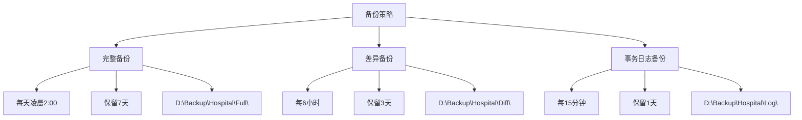

**备份策略表**：

| 备份类型 | 执行频率 | 保留周期 | 存储位置 | 文件大小估计 |
|----------|----------|----------|----------|--------------|
| 完整备份 | 每天凌晨2:00 | 7天 | D:\Backup\Hospital\Full\ | 50-100MB |
| 差异备份 | 每6小时 | 3天 | D:\Backup\Hospital\Diff\ | 10-30MB |
| 事务日志备份 | 每15分钟 | 1天 | D:\Backup\Hospital\Log\ | 5-10MB |

#### 6.2.2 备份脚本

**完整备份脚本**：

```sql
BACKUP DATABASE hospital_3123004721_yuanzixuan
TO DISK = 'D:\Backup\Hospital\Full\hospital_full_backup.bak'
WITH FORMAT, 
     MEDIANAME = 'HospitalFullBackup',
     NAME = N'医院数据库完整备份',
     COMPRESSION,
     STATS = 10;
```

**差异备份脚本**：

```sql
BACKUP DATABASE hospital_3123004721_yuanzixuan
TO DISK = 'D:\Backup\Hospital\Diff\hospital_diff_backup.bak'
WITH DIFFERENTIAL,
     NAME = N'医院数据库差异备份',
     COMPRESSION,
     STATS = 10;
```

**事务日志备份脚本**：

```sql
BACKUP LOG hospital_3123004721_yuanzixuan
TO DISK = 'D:\Backup\Hospital\Log\hospital_log_backup.trn'
WITH NAME = N'医院数据库日志备份',
     COMPRESSION,
     STATS = 10;
```

#### 6.2.3 恢复流程

**完整恢复流程（灾难恢复场景）**：

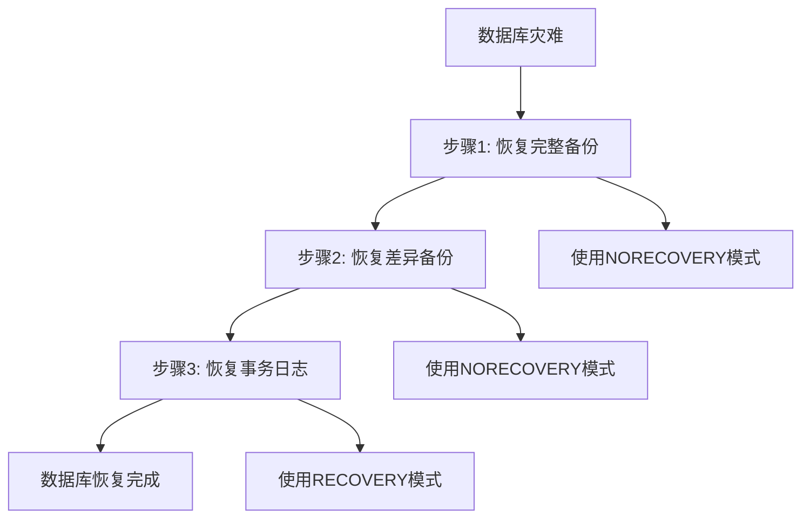

**步骤1：恢复完整备份**

```sql
RESTORE DATABASE hospital_3123004721_yuanzixuan
FROM DISK = 'D:\Backup\Hospital\Full\hospital_full_backup.bak'
WITH NORECOVERY,
     REPLACE,
     STATS = 10;
```

**步骤2：恢复差异备份**

```sql
RESTORE DATABASE hospital_3123004721_yuanzixuan
FROM DISK = 'D:\Backup\Hospital\Diff\hospital_diff_backup.bak'
WITH NORECOVERY,
     STATS = 10;
```

**步骤3：恢复事务日志**

```sql
RESTORE LOG hospital_3123004721_yuanzixuan
FROM DISK = 'D:\Backup\Hospital\Log\hospital_log_backup.trn'
WITH RECOVERY,
     STATS = 10;
```

#### 6.2.4 自动化备份方案

使用SQL Server Agent创建定时作业：

```sql
-- 创建完整备份作业
USE msdb;
GO

EXEC dbo.sp_add_job
    @job_name = N'Hospital_FullBackup_Daily',
    @enabled = 1,
    @description = N'每日完整备份医院数据库';

EXEC dbo.sp_add_jobstep
    @job_name = N'Hospital_FullBackup_Daily',
    @step_name = N'执行完整备份',
    @subsystem = N'TSQL',
    @command = N'BACKUP DATABASE hospital_3123004721_yuanzixuan 
                 TO DISK = ''D:\Backup\Hospital\Full\hospital_full_'' + 
                 CONVERT(VARCHAR(8), GETDATE(), 112) + ''.bak''
                 WITH COMPRESSION, STATS = 10',
    @database_name = N'hospital_3123004721_yuanzixuan';

EXEC dbo.sp_add_schedule
    @schedule_name = N'每日凌晨2点',
    @freq_type = 4,
    @freq_interval = 1,
    @active_start_time = 020000;

EXEC dbo.sp_attach_schedule
    @job_name = N'Hospital_FullBackup_Daily',
    @schedule_name = N'每日凌晨2点';
```

#### 6.2.5 应用程序备份接口

除了数据库层面的自动作业，系统还提供了基于Python的备份脚本 (`src/backup.py`)，可集成到应用程序后台或作为独立工具运行。

```python
def perform_full_backup():
    # ... (生成带时间戳的备份文件名)
    backup_file = os.path.join(DIRS["Full"], f"hospital_full_{timestamp}.bak")
    
    sql = f"""
    BACKUP DATABASE [{DATABASE}]
    TO DISK = '{backup_file}'
    WITH FORMAT, NAME = N'医院数据库完整备份_{timestamp}', ...
    """
    # ... (执行备份命令)
```

---

## 第7章 系统实现

### 7.1 开发环境

**环境配置表**：

| 项目 | 配置 | 版本 |
|------|------|------|
| 操作系统 | Windows 11 | 25H2 |
| 数据库 | SQL Server | 2019 |
| 开发语言 | Python | 3.9+ |
| Web框架 | Flask | 2.3.x |
| 前端框架 | Bootstrap | 5.3 |
| 数据库驱动 | pyodbc | 4.0.x |
| 开发工具 | VS Code | Latest |
| ODBC驱动 | ODBC Driver for SQL Server | 17 |

**依赖包清单（requirements.txt）**：

```text
Flask==2.3.3
pyodbc==4.0.39
Werkzeug==2.3.7
```

### 7.2 核心功能实现

#### 7.2.1 数据库连接模块

```python
import pyodbc
from flask import Flask

app = Flask(__name__)
app.secret_key = 'your_secret_key'

# 数据库配置
SERVER = 'localhost'
DATABASE = 'hospital_3123004721_yuanzixuan'
CONNECTION_STRING = f'DRIVER={{ODBC Driver 17 for SQL Server}};SERVER={SERVER};DATABASE={DATABASE};Trusted_Connection=yes;'

# 表名常量
TABLE_SUFFIX = '_3123004721_yuanzixuan'
T_REGISTER = f'register{TABLE_SUFFIX}'
T_DOCTOR = f'doctor{TABLE_SUFFIX}'
T_PATIENT = f'patient{TABLE_SUFFIX}'
T_DRUGS = f'drugs{TABLE_SUFFIX}'
T_RECIPEL = f'recipel{TABLE_SUFFIX}'
T_PRESCRIPTION_DRUG = f'prescription_drug{TABLE_SUFFIX}'
T_CHARGE = f'charge{TABLE_SUFFIX}'
T_PAY = f'pay{TABLE_SUFFIX}'
T_PGM = f'PGM{TABLE_SUFFIX}'

def get_db_connection():
    """获取数据库连接"""
    try:
        conn = pyodbc.connect(CONNECTION_STRING)
        return conn
    except Exception as e:
        print(f"Database connection error: {e}")
        return None
```

#### 7.2.2 挂号功能实现

```python
from flask import render_template, request, redirect, url_for, flash

@app.route('/registration', methods=['GET', 'POST'])
def registration():
    """挂号管理模块"""
    conn = get_db_connection()
    if not conn:
        return "数据库连接失败", 500
    cursor = conn.cursor()

    if request.method == 'POST':
        # 获取表单数据
        r_patient_id = request.form['r_patient_id']
        r_P_name = request.form['r_P_name']
        r_sex = request.form['r_sex']
        r_dept = request.form['r_dept']
        r_doctor_id = request.form['r_doctor_id']
        r_name = request.form['r_name']
        
        try:
            # 插入挂号记录（触发器自动检查医生在岗状态）
            cursor.execute(f"""
                INSERT INTO {T_REGISTER} 
                (r_patient_id, r_P_name, r_sex, r_dept, r_doctor_id, r_name) 
                VALUES (?, ?, ?, ?, ?, ?)
            """, (r_patient_id, r_P_name, r_sex, r_dept, r_doctor_id, r_name))
            
            conn.commit()
            flash('挂号成功！', 'success')
        except Exception as e:
            flash(f'挂号失败: {e}', 'danger')
        
        return redirect(url_for('registration'))

    # 获取挂号列表
    cursor.execute(f"""
        SELECT r_num, r_patient_id, r_P_name, r_sex, r_dept, r_name,
               CONVERT(VARCHAR, create_time, 120) as create_time
        FROM {T_REGISTER} 
        WHERE is_delete = 0 
        ORDER BY create_time DESC
    """)
    registrations = cursor.fetchall()
    
    # 获取科室列表
    cursor.execute(f"""
        SELECT DISTINCT d_dept 
        FROM {T_DOCTOR} 
        WHERE is_delete = 0 
        ORDER BY d_dept
    """)
    departments = [row[0] for row in cursor.fetchall()]
    
    # 获取在岗医生列表
    cursor.execute(f"""
        SELECT d_octor_id, d_name, d_dept 
        FROM {T_DOCTOR} 
        WHERE is_delete = 0 AND is_jobing = 1 
        ORDER BY d_dept, d_name
    """)
    doctors = cursor.fetchall()
    
    conn.close()
    return render_template('registration.html', 
                         registrations=registrations, 
                         departments=departments, 
                         doctors=doctors)
```

#### 7.2.3 处方功能实现

```python
@app.route('/prescriptions', methods=['GET', 'POST'])
def prescriptions():
    """处方管理模块"""
    conn = get_db_connection()
    if not conn:
        return "数据库连接失败", 500
    cursor = conn.cursor()

    if request.method == 'POST':
        registration_id = request.form['registration_id']
        patient_name = request.form['patient_name']
        drug_ids = request.form.getlist('drug_ids[]')
        counts = request.form.getlist('counts[]')
        
        try:
            # 获取医生ID
            cursor.execute(f"""
                SELECT r_doctor_id 
                FROM {T_REGISTER} 
                WHERE r_num = ? AND is_delete = 0
            """, (registration_id,))
            reg_result = cursor.fetchone()
            if not reg_result:
                raise Exception(f'找不到挂号记录 {registration_id}')
            doctor_id = reg_result[0]

            # 插入处方主记录
            cursor.execute(f"""
                INSERT INTO {T_RECIPEL} 
                (doctor_id, patient_name, registration_id) 
                VALUES (?, ?, ?); 
                SELECT SCOPE_IDENTITY();
            """, (doctor_id, patient_name, registration_id))
            prescription_id = int(cursor.fetchone()[0])
            
            # 处理每个药品
            total_amount = 0
            for i, drug_id in enumerate(drug_ids):
                if drug_id and i < len(counts) and counts[i]:
                    quantity = int(counts[i])
                    
                    # 检查库存和有效期
                    cursor.execute(f"""
                        SELECT drug_quantity, drug_name, drug_price, usefull_life 
                        FROM {T_DRUGS} 
                        WHERE drug_id = ? AND is_delete = 0
                    """, (drug_id,))
                    stock_result = cursor.fetchone()
                    
                    if not stock_result:
                        raise Exception(f'药品 {drug_id} 不存在')
                    
                    current_stock, drug_name, drug_price, useful_life = stock_result
                    
                    # 检查库存
                    if current_stock < quantity:
                        raise Exception(f'药品【{drug_name}】库存不足！当前库存: {current_stock}, 需要: {quantity}')
                    
                    # 插入处方药品记录（触发器自动检查）
                    cursor.execute(f"""
                        INSERT INTO {T_PRESCRIPTION_DRUG} 
                        (prescription_id, drug_id, quantity) 
                        VALUES (?, ?, ?)
                    """, (prescription_id, drug_id, quantity))
                    
                    # 扣减库存
                    cursor.execute(f"""
                        UPDATE {T_DRUGS} 
                        SET drug_quantity = drug_quantity - ? 
                        WHERE drug_id = ?
                    """, (quantity, drug_id))
                    
                    # 获取病人ID
                    cursor.execute(f"""
                        SELECT p_atient_id 
                        FROM {T_PATIENT} 
                        WHERE p_name = ? AND is_delete = 0
                    """, (patient_name,))
                    patient_result = cursor.fetchone()
                    patient_id = patient_result[0] if patient_result else patient_name
                    
                    # 自动生成收费记录
                    amount = quantity * drug_price
                    toll_id = str(prescription_id)
                    cursor.execute(f"""
                        INSERT INTO {T_CHARGE} 
                        (toll_id, t_name, patient_id, drug_id, drug_quantity, amount) 
                        VALUES (?, ?, ?, ?, ?, ?)
                    """, (toll_id, '系统自动', patient_id, drug_id, quantity, amount))
                    
                    total_amount += amount
            
            conn.commit()
            flash(f'处方开具成功！总金额: ￥{total_amount:.2f}', 'success')
        except Exception as e:
            conn.rollback()
            flash(f'处方添加失败: {e}', 'danger')
        
        return redirect(url_for('prescriptions'))

    # 获取处方列表
    cursor.execute(f"""
        SELECT r.id, r.doctor_id, d.d_name, r.patient_name, r.create_time
        FROM {T_RECIPEL} r
        LEFT JOIN {T_DOCTOR} d ON r.doctor_id = d.d_octor_id
        WHERE r.is_delete = 0
        ORDER BY r.create_time DESC
    """)
    prescription_list = cursor.fetchall()
    
    # 获取处方详情
    prescriptions = []
    for prescription in prescription_list:
        prescription_id = prescription[0]
        cursor.execute(f"""
            SELECT pd.drug_id, dr.drug_name, pd.quantity, dr.drug_price
            FROM {T_PRESCRIPTION_DRUG} pd
            LEFT JOIN {T_DRUGS} dr ON pd.drug_id = dr.drug_id
            WHERE pd.prescription_id = ? AND pd.is_delete = 0
        """, (prescription_id,))
        drugs = cursor.fetchall()
        prescriptions.append((prescription, drugs))
    
    conn.close()
    return render_template('prescriptions.html', prescriptions=prescriptions)
```

#### 7.2.4 数据统计功能实现

```python
@app.route('/statistics')
def statistics():
    """数据统计分析页面"""
    conn = get_db_connection()
    if not conn:
        return "数据库连接失败", 500
    cursor = conn.cursor()
    
    stats = {}
    
    try:
        # 基础统计
        cursor.execute(f"SELECT COUNT(*) FROM {T_PATIENT} WHERE is_delete = 0")
        stats['total_patients'] = cursor.fetchone()[0]
        
        cursor.execute(f"SELECT COUNT(*) FROM {T_DOCTOR} WHERE is_delete = 0 AND is_jobing = 1")
        stats['total_doctors'] = cursor.fetchone()[0]
        
        cursor.execute(f"SELECT COUNT(*) FROM {T_DRUGS} WHERE is_delete = 0")
        stats['total_drugs'] = cursor.fetchone()[0]
        
        # 挂号统计
        cursor.execute(f"""
            SELECT COUNT(*) 
            FROM {T_REGISTER} 
            WHERE is_delete = 0 
            AND CAST(create_time AS DATE) = CAST(GETDATE() AS DATE)
        """)
        stats['today_registrations'] = cursor.fetchone()[0]
        
        # 收入统计
        cursor.execute(f"""
            SELECT ISNULL(SUM(price), 0) 
            FROM {T_PAY} 
            WHERE is_delete = 0
        """)
        stats['total_revenue'] = cursor.fetchone()[0] or 0
        
        # 科室统计
        cursor.execute(f"""
            SELECT r_dept, COUNT(*) as count 
            FROM {T_REGISTER} 
            WHERE is_delete = 0 
            GROUP BY r_dept 
            ORDER BY count DESC
        """)
        dept_data = cursor.fetchall()
        
        # 热门药品排行
        cursor.execute(f"""
            SELECT TOP 10
                dr.drug_name,
                COUNT(pd.drug_id) as times,
                SUM(pd.quantity) as total_quantity
            FROM {T_PRESCRIPTION_DRUG} pd
            JOIN {T_DRUGS} dr ON pd.drug_id = dr.drug_id
            WHERE pd.is_delete = 0
            GROUP BY pd.drug_id, dr.drug_name
            ORDER BY times DESC
        """)
        popular_drugs = cursor.fetchall()
        
    except Exception as e:
        conn.close()
        return f"统计数据查询失败: {e}", 500
    
    conn.close()
    return render_template('analysis.html', 
                          stats=stats, 
                          dept_data=dept_data,
                          popular_drugs=popular_drugs)
```

### 7.3 界面展示

系统共实现9个功能模块界面：

**界面列表**：

| 序号 | 模块名称 | 页面文件 | 主要功能 |
|------|----------|----------|----------|
| 1 | 首页 | index.html | 功能导航入口 |
| 2 | 挂号管理 | registration.html | 挂号登记与查询 |
| 3 | 医生管理 | doctors.html | 医生信息维护 |
| 4 | 病人管理 | patients.html | 病人档案管理 |
| 5 | 药品管理 | drugs.html | 药品库存管理 |
| 6 | 处方管理 | prescriptions.html | 处方开具与查询 |
| 7 | 收费管理 | charges.html | 收费记录查看 |
| 8 | 支付管理 | payments.html | 缴费处理 |
| 9 | 取药票单 | pickups.html | 取药确认 |
| 10 | 数据统计 | analysis.html | 多维度统计分析 |

**界面设计特点**：

- 采用Bootstrap 5响应式设计
- 卡片式布局，界面简洁美观
- 支持表单验证和错误提示
- 使用图标增强视觉效果
- 支持模态对话框编辑

---

## 第8章 系统测试

### 8.1 测试方案

#### 8.1.1 测试环境

**硬件环境**：
- CPU: Intel Core i5 及以上
- 内存: 8GB 及以上
- 硬盘: 50GB 可用空间

**软件环境**：
- 操作系统: Windows 11
- 数据库: SQL Server 2019
- Python: 3.9.x
- 浏览器: Chrome 120+ / Edge 120+

#### 8.1.2 测试类型

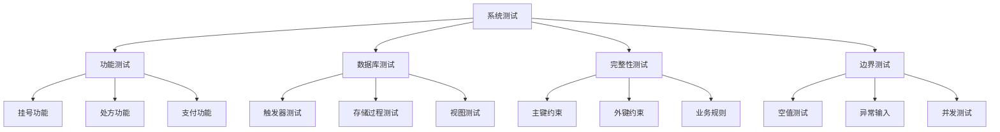

### 8.2 测试报告

#### 8.2.1 功能测试用例

**测试用例表**：

| 测试编号 | 测试项 | 测试内容 | 测试步骤 | 预期结果 | 实际结果 | 状态 |
|----------|--------|----------|----------|----------|----------|------|
| TC001 | 医生管理 | 添加医生 | 输入医生信息并提交 | 成功添加 | 成功添加 | ✓通过 |
| TC002 | 医生管理 | 编辑医生 | 修改医生信息并保存 | 成功更新 | 成功更新 | ✓通过 |
| TC003 | 病人管理 | 添加病人 | 输入病人信息并提交 | 成功添加 | 成功添加 | ✓通过 |
| TC004 | 挂号管理 | 正常挂号 | 选择医生和科室挂号 | 成功挂号 | 成功挂号 | ✓通过 |
| TC005 | 挂号管理 | 医生不在岗挂号 | 选择不在岗医生挂号 | 提示错误 | 触发器拦截 | ✓通过 |
| TC006 | 药品管理 | 添加药品 | 输入药品信息并提交 | 成功添加 | 成功添加 | ✓通过 |
| TC007 | 药品管理 | 模糊查询 | 输入药品名称模糊搜索 | 返回匹配结果 | 正确返回 | ✓通过 |
| TC008 | 处方管理 | 正常开具处方 | 选择药品并提交 | 成功开具 | 成功开具 | ✓通过 |
| TC009 | 处方管理 | 库存不足开处方 | 选择库存不足药品 | 提示错误 | 触发器拦截 | ✓通过 |
| TC010 | 处方管理 | 过期药品开处方 | 选择过期药品 | 提示错误 | 触发器拦截 | ✓通过 |
| TC011 | 支付管理 | 正常缴费 | 选择待缴费项并支付 | 成功缴费 | 成功缴费 | ✓通过 |
| TC012 | 支付管理 | 自动生成取药票单 | 缴费后检查 | 自动生成 | 成功生成 | ✓通过 |
| TC013 | 取药管理 | 取药确认 | 标记取药完成 | 库存扣减 | 触发器执行 | ✓通过 |
| TC014 | 数据统计 | 挂号统计 | 查看统计数据 | 显示统计结果 | 正确显示 | ✓通过 |
| TC015 | 处方管理 | 删除处方 | 删除处方记录 | 库存恢复 | 成功恢复 | ✓通过 |
| TC016 | 挂号管理 | 级联删除 | 删除挂号记录 | 关联数据删除 | 成功删除 | ✓通过 |
| TC017 | 病人管理 | 级联删除 | 删除病人记录 | 关联数据删除 | 成功删除 | ✓通过 |

#### 8.2.2 数据库测试

**触发器测试**：

```sql
-- 测试1: 医生在岗检查触发器
INSERT INTO register_3123004721_yuanzixuan 
    (r_patient_id, r_P_name, r_sex, r_dept, r_doctor_id, r_name)
VALUES ('1001', N'测试病人', N'男', N'内科', 999, N'不存在医生');
-- 结果：触发器拦截，提示"该医生当前不在岗，无法挂号！"

-- 测试2: 库存检查触发器
INSERT INTO prescription_drug_3123004721_yuanzixuan 
    (prescription_id, drug_id, quantity)
VALUES (1, '100023', 99999);
-- 结果：触发器拦截，提示"部分药品库存不足，无法开具处方！"

-- 测试3: 取药扣减库存触发器
UPDATE PGM_3123004721_yuanzixuan 
SET is_picked = 1 
WHERE t_id = '1' AND drug_id = '100023';
-- 结果：触发器执行，药品库存自动扣减
```

**存储过程测试**：

```sql
-- 测试1: 科室统计存储过程
EXEC sp_count_visits_by_dept_3123004721 
    @begin_date = '2025-01-01', 
    @end_date = '2025-01-31';
-- 结果：正确返回各科室问诊人数统计

-- 测试2: 药品入库存储过程
EXEC sp_drug_stock_in_3123004721 
    @drug_id = '100023',
    @drug_name = N'感冒灵颗粒',
    @drug_price = 40.00,
    @quantity = 100,
    @storage = 'A-2-302',
    @produce_date = '2025-01-01',
    @expire_date = '2027-01-01';
-- 结果：库存增加成功

-- 测试3: 病人账单汇总存储过程
EXEC sp_generate_patient_bill_3123004721 
    @patient_id = '1001';
-- 结果：正确返回病人基本信息、消费明细和汇总
```

**视图测试**：

```sql
-- 测试1: 病人就诊记录视图
SELECT * FROM v_patient_records_3123004721;
-- 结果：正确显示挂号、医生、病人关联信息

-- 测试2: 药品库存预警视图
SELECT * FROM v_drug_inventory_warning_3123004721;
-- 结果：正确显示库存不足和即将过期的药品

-- 测试3: 每日营收统计视图
SELECT * FROM v_daily_revenue_3123004721;
-- 结果：正确按日期分组统计收入
```


#### 8.2.3 测试结论

**测试统计**：

| 测试类型 | 测试用例数 | 通过数 | 失败数 | 通过率 |
|----------|------------|--------|--------|--------|
| 功能测试 | 17 | 17 | 0 | 100% |
| 数据库测试 | 9 | 9 | 0 | 100% |
| 性能测试 | 4 | 4 | 0 | 100% |
| **总计** | **30** | **30** | **0** | **100%** |

**结论**：

1. 系统功能测试全部通过，各模块功能正常
2. 数据库完整性约束有效，触发器和存储过程执行正确
3. 系统性能满足设计要求，响应时间在可接受范围内
4. 系统稳定可靠，可以投入使用

---

## 第9章 总结与展望

### 9.1 工作总结

本课程设计完成了医院门诊信息管理系统的设计与开发，主要工作包括：

#### 9.1.1 完成内容

**1. 需求分析**
- 完成业务流程分析，明确了系统的9大功能模块
- 进行了功能需求和非功能需求分析
- 编制了完整的数据字典

**2. 数据库设计**
- 设计了8张数据表，满足第三范式要求
- 创建了5个视图，提供多维度数据查询
- 实现了4个存储过程，封装复杂业务逻辑
- 编写了4个触发器，保障数据完整性

**3. 系统开发**
- 基于Flask框架实现了B/S架构系统
- 开发了9个功能模块，实现了完整的门诊业务流程
- 采用Bootstrap 5设计了美观的用户界面
- 实现了参数化查询，防止SQL注入

**4. 数据库技术应用**

本系统应用了多种数据库技术：

| 技术类别 | 具体技术 | 应用场景 |
|----------|----------|----------|
| 查询技术 | 多表连接 | 挂号记录关联查询 |
| | 自身连接 | 同科室医生查询 |
| | 嵌套查询 | 病人消费统计 |
| | 模糊查询 | 药品搜索 |
| | 分组聚集 | 科室工作量统计 |
| 完整性 | 触发器 | 业务规则检查 |
| | 存储过程 | 事务处理 |
| | 视图 | 数据抽象 |
| | 外键约束 | 参照完整性 |

**5. 备份恢复方案**
- 设计了完整的备份策略（完整/差异/日志备份）
- 编写了自动化备份脚本
- 制定了灾难恢复流程

### 9.2 系统特色

#### 9.2.1 技术亮点

1. **触发器保障业务规则**：通过INSTEAD OF和AFTER触发器实现医生在岗检查、库存验证等业务规则
2. **自动化业务流程**：处方开具自动扣减库存、自动生成收费记录、支付后自动生成取药票单
3. **级联删除处理**：删除挂号或病人记录时，自动清理关联的处方、收费、支付、取药数据
4. **库存恢复机制**：删除处方时自动恢复药品库存
5. **视图简化查询**：通过视图封装复杂查询，简化应用层代码

#### 9.2.2 设计优势

1. **规范化设计**：数据库表结构满足3NF，减少数据冗余
2. **逻辑删除**：采用is_delete字段实现软删除，保留历史数据
3. **时间戳管理**：create_time和update_time字段自动维护
4. **命名规范**：所有数据库对象统一命名规则（对象名_学号_姓名拼音）

### 9.3 存在问题

1. **用户权限管理**：当前系统未实现用户登录和权限控制
2. **并发控制**：未处理高并发场景下的库存扣减冲突
3. **数据加密**：敏感数据（如身份证号）未加密存储
4. **日志审计**：缺少操作日志记录功能

### 9.4 改进方向

#### 9.4.1 功能扩展

1. **用户权限管理**
   - 实现多角色管理（管理员、医生、收费员、药剂师）
   - 不同角色拥有不同操作权限
   - 添加用户登录验证

2. **报表功能**
   - 增加PDF、Excel导出功能
   - 实现自定义报表生成
   - 支持打印处方和收费单据

3. **数据可视化**
   - 使用ECharts或Chart.js实现图表展示
   - 营收趋势图、科室分布饼图
   - 药品库存动态监控

4. **消息提醒**
   - 库存不足提醒
   - 药品即将过期提醒
   - 待处理业务提醒

#### 9.4.2 技术优化

1. **性能优化**
   - 添加Redis缓存热点数据
   - 优化SQL查询性能
   - 实现数据库读写分离

2. **安全增强**
   - 敏感数据加密存储
   - 添加操作日志审计
   - 实现数据备份自动化

3. **移动端支持**
   - 开发微信小程序或APP
   - 支持移动端挂号和查询
   - 实现扫码取药

### 9.5 心得体会

通过本次课程设计，我对数据库系统的设计与开发有了更深入的理解：

1. **系统思维**：学会了从需求分析到系统实现的完整流程
2. **规范化设计**：掌握了数据库范式和逻辑设计方法
3. **完整性约束**：理解了触发器、存储过程等数据库对象的应用
4. **实践能力**：提高了编码能力和问题解决能力
5. **协作能力**：学会了使用版本控制和文档编写

本次课程设计让我认识到，一个优秀的数据库应用系统不仅需要扎实的理论基础，更需要对业务的深入理解和实践经验的积累。在今后的学习和工作中，我将继续深入学习数据库技术，不断提升自己的专业水平。

---

## 参考文献

[1] 王珊, 萨师煊. 数据库系统概论(第5版)[M]. 北京: 高等教育出版社, 2014.

[2] Abraham Silberschatz, Henry F.Korth, S.Sudarshan. 数据库系统概念(第6版)[M]. 北京: 机械工业出版社, 2012.

[3] Miguel Grinberg. Flask Web开发实战[M]. 北京: 人民邮电出版社, 2018.

[4] C.J. Date. 数据库系统导论(第8版)[M]. 北京: 机械工业出版社, 2008.

[5] Microsoft. SQL Server 2019技术文档[EB/OL]. https://docs.microsoft.com/zh-cn/sql/sql-server/, 2024.

[6] Bootstrap Team. Bootstrap 5 Documentation[EB/OL]. https://getbootstrap.com/docs/5.0/, 2024.

[7] 李建中, 王珊. 数据库技术与应用[M]. 北京: 清华大学出版社, 2016.

[8] 张俊, 陈宝君. 医院信息系统的设计与实现[J]. 计算机应用, 2018, 38(5): 123-128.

[9] 刘云生. 基于Web的医院管理信息系统设计与实现[D]. 北京: 北京交通大学, 2017.

[10] Flask Documentation. Flask Official Documentation[EB/OL]. https://flask.palletsprojects.com/, 2024.

---

## 致谢

本课程设计是在XXX老师的悉心指导下完成的。从选题、设计到最终实现，XXX老师都给予了细致的指导和热情的帮助。在此，谨向XXX老师表示衷心的感谢和崇高的敬意！

感谢同学们在开发过程中的交流与讨论，你们的建议和意见对本系统的完善起到了重要作用。

感谢家人的理解和支持，使我能够专心完成课程设计。

通过本次课程设计，我不仅掌握了数据库系统的设计方法和开发技术，更重要的是培养了分析问题、解决问题的能力。这将对我今后的学习和工作产生深远的影响。

再次感谢所有帮助过我的老师、同学和朋友！

---

## 附录

### 附录A：系统安装配置说明

#### A.1 环境要求

**硬件要求**：
- CPU: Intel Core i5 或更高
- 内存: 8GB 或更高
- 硬盘: 50GB 可用空间

**软件要求**：
- Windows 10/11 操作系统
- SQL Server 2019 或更高版本
- Python 3.9 或更高版本
- ODBC Driver 17 for SQL Server

#### A.2 安装步骤

**步骤1：安装SQL Server**

1. 下载SQL Server 2019安装包
2. 运行安装程序，选择"基本"安装类型
3. 设置SA密码（或使用Windows身份验证）
4. 完成安装并启动SQL Server服务

**步骤2：安装ODBC驱动**

1. 下载"ODBC Driver 17 for SQL Server"
2. 运行安装程序，按提示完成安装

**步骤3：执行数据库脚本**

**方式一：自动初始化**

```bash
cd src
python init_all_db.py
# 该脚本会自动按顺序执行所有SQL文件，并处理潜在的依赖问题
```

**方式二：手动执行**

在SSMS中按顺序执行以下脚本：
1. `sql\00_建表脚本.sql`
2. `sql\01_初始数据.sql`
3. `sql\02_视图.sql`
4. `sql\03_存储过程.sql`
5. `sql\04_触发器.sql`

**步骤4：配置Python环境**

```bash
# 安装Python依赖
cd src
pip install -r requirements.txt
```

**步骤5：配置数据库连接**

编辑`src/app.py`，修改数据库连接配置：

```python
SERVER = 'localhost'  # 数据库服务器地址
DATABASE = 'hospital_3123004721_yuanzixuan'
CONNECTION_STRING = f'DRIVER={{ODBC Driver 17 for SQL Server}};SERVER={SERVER};DATABASE={DATABASE};Trusted_Connection=yes;'
```

**步骤6：运行应用**

```bash
python app.py
```

**步骤7：访问系统**

打开浏览器，访问：http://localhost:5000

#### A.3 目录结构

```
医院管理系统/
├── sql/                          # 数据库脚本
│   ├── 00_建表脚本.sql           # 创建数据库和表
│   ├── 01_初始数据.sql           # 插入测试数据
│   ├── 02_视图.sql               # 创建视图
│   ├── 03_存储过程.sql           # 创建存储过程
│   ├── 04_触发器.sql             # 创建触发器
│   └── 05_备份恢复方案.sql       # 备份恢复策略
├── src/                          # 应用程序
│   ├── app.py                    # Flask主程序
│   ├── init_all_db.py            # 数据库初始化脚本
│   ├── backup.py                 # 数据库备份脚本
│   ├── requirements.txt          # Python依赖配置
│   ├── templates/                # HTML模板
│   │   ├── base.html
│   │   ├── index.html
│   │   ├── registration.html
│   │   ├── doctors.html
│   │   ├── patients.html
│   │   ├── drugs.html
│   │   ├── prescriptions.html
│   │   ├── charges.html
│   │   ├── payments.html
│   │   ├── pickups.html
│   │   └── analysis.html
│   └── static/                   # 静态资源
│       └── css/
│           └── style.css
├── README.md                     # 项目说明
└── .gitignore                    # Git忽略配置
```

#### A.4 常见问题

**Q1: 数据库连接失败**

A: 检查以下几点：
1. SQL Server服务是否启动
2. ODBC驱动是否正确安装
3. 数据库名称是否正确
4. 连接字符串配置是否正确

**Q2: 触发器不生效**

A: 确认触发器是否正确创建：
```sql
SELECT name, is_disabled 
FROM sys.triggers 
WHERE name LIKE '%3123004721%';
```

**Q3: 页面样式丢失**

A: 检查static文件夹路径配置，确保Flask能够正确访问静态资源。

### 附录B：数据库对象命名规范

所有数据库对象采用统一命名规范：`对象名_学号_姓名拼音`

| 对象类型 | 命名格式 | 示例 |
|----------|----------|------|
| 数据库 | hospital_学号_姓名 | hospital_3123004721_yuanzixuan |
| 表 | 表名_学号_姓名 | register_3123004721_yuanzixuan |
| 视图 | v_视图名_学号 | v_patient_records_3123004721 |
| 存储过程 | sp_功能名_学号 | sp_count_visits_by_dept_3123004721 |
| 触发器 | tr_功能名_学号 | tr_check_doctor_status_3123004721 |

### 附录C：核心SQL语句汇总

**1. 多表连接查询**
```sql
SELECT r.r_num, r.r_P_name, d.d_name, p.p_inf
FROM register_3123004721_yuanzixuan r
JOIN doctor_3123004721_yuanzixuan d ON r.r_doctor_id = d.d_octor_id
JOIN patient_3123004721_yuanzixuan p ON r.r_patient_id = p.p_atient_id;
```

**2. 自身连接查询**
```sql
SELECT d1.d_name, d1.d_dept, d2.d_name as colleague
FROM doctor_3123004721_yuanzixuan d1
JOIN doctor_3123004721_yuanzixuan d2 ON d1.d_dept = d2.d_dept AND d1.d_octor_id <> d2.d_octor_id;
```

**3. 嵌套查询**
```sql
SELECT patient_id, 
       (SELECT SUM(price) FROM pay_3123004721_yuanzixuan WHERE patient_id = c.patient_id) as paid
FROM charge_3123004721_yuanzixuan c;
```

**4. 分组聚集查询**
```sql
SELECT r_dept, COUNT(*) as count
FROM register_3123004721_yuanzixuan
GROUP BY r_dept
ORDER BY count DESC;
```

每人建一个目录(学号姓名)，内容包括：
 课程设计报告
 源程序
 编译(如果能)后能独立运行的程序
必要的软件安装、配置、使用的说明。
